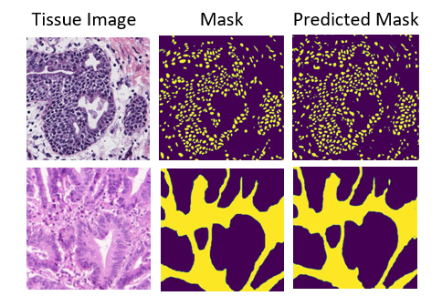
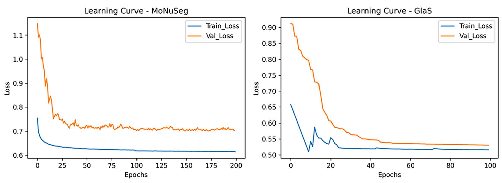

# HistoSeg : Quick attention with multi-loss function for multi-structure segmentation in digital histology images
    


Histological Image Segmentation<br>This repo contains the code to Test and Train the HistoSeg


HistoSeg is an Encoder-Decoder DCNN which utilizes the novel Quick Attention Modules and Multi Loss function to generate segmentation masks from histopathological images with greater accuracy.

## HistoSeg Qualitative Results
<p align="left">
  
</p>

## Datasets used for trainig HistoSeg

### MoNuSeg - Multi-organ nuclei segmentation from H&E stained histopathological images
link: https://monuseg.grand-challenge.org/

### GlaS -  Gland segmentation in histology images
link: https://warwick.ac.uk/fac/cross_fac/tia/data/glascontest/

## Trained Weights are available in the repo to test the HistoSeg
For MoNuSeg Dataset link: https://github.com/saadwazir/HistoSeg/blob/main/HistoSeg_MoNuSeg_.h5

For GlaS Dataset link: https://github.com/saadwazir/HistoSeg/blob/main/HistoSeg_GlaS_.h5

## Data Preprocessing for Training
After downloading the dataset you must generate patches of images and their corresponding masks (Ground Truth), & convert it into numpy arrays or you can use dataloaders directly inside the code.
you can generate patches using Image_Patchyfy. Link : https://github.com/saadwazir/Image_Patchyfy
```
For example to train HistoSeg on MoNuSeg Dataset, the distribution of dataset after creating pathes

X_train 1470x256x256x3 
y_train 1470x256x256x1
X_val 686x256x256x3
y_Val 686x256x256x1
```
## Data Preprocessing for Testing
You just need to resize the images and their corresponding masks (Ground Truth) into same size i.e all the samples must have same resolution, and then convert it into numpy arrays.

```
For example to test HistoSeg on MoNuSeg Dataset, the shapes of dataset after creating numpy arrays are

X_test 14x1000x1000x3 
y_test 14x1000x1000x1
```
## Training
To train HistoSeg use the following command

```
python HistoSeg_Train.py --train_images 'path' --train_masks 'path' --val_images 'path' --val_masks 'path' --width 256 --height 256 --epochs 100 --batch 16
```
## Testing
To test HistoSeg use the following command
```
python HistoSeg_Test.py --images 'path' --masks 'path' --weights 'path' --width 1000 --height 1000

For example to test HistoSeg on MoNuSeg Dataset with trained weights, use the following command
python HistoSeg_Test.py --images 'X_test_MoNuSeg_14x1000x1000.npy' --masks 'y_test_MoNuSeg_14x1000x1000.npy' --weights 'HistoSeg_MoNuSeg_.h5' --width 1000 --height 1000
```
## HistoSeg Quantitative Results
<table>
<thead>
  <tr>
    <th colspan="3">MoNuSeg</th>
    <th colspan="3">GlaS</th>
  </tr>
</thead>
<tbody>
  <tr>
    <td>F1</td>
    <td>IoU</td>
    <td>Dice</td>
    <td>F1</td>
    <td>IoU</td>
    <td>Dice</td>
  </tr>
  <tr>
    <td>75.08</td>
    <td>71.06</td>
    <td>95.20</td>
    <td>98.07</td>
    <td>76.73</td>
    <td>99.09</td>
  </tr>
</tbody>
</table>

## HistoSeg Learning Curve

<p align="left">
  
</p>

`Author` [Saad Wazir](https://github.com/saadwazir) (saadwazir.pk@gmail.com)
